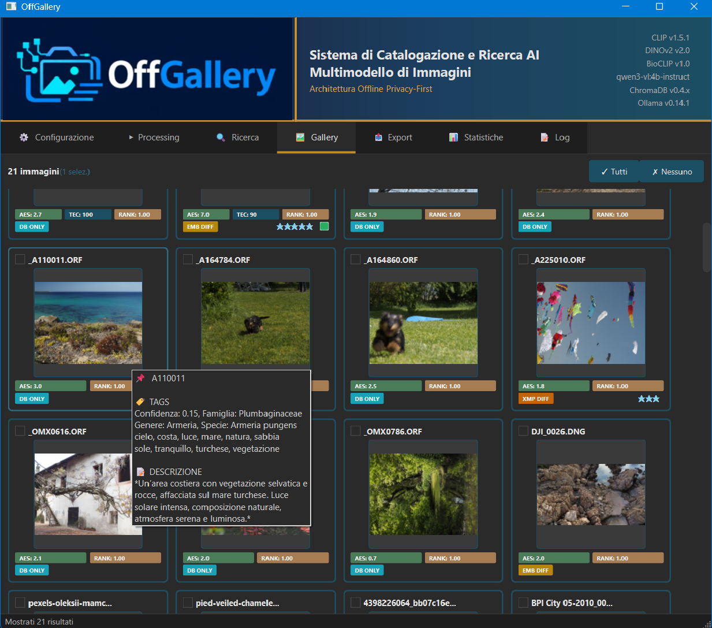
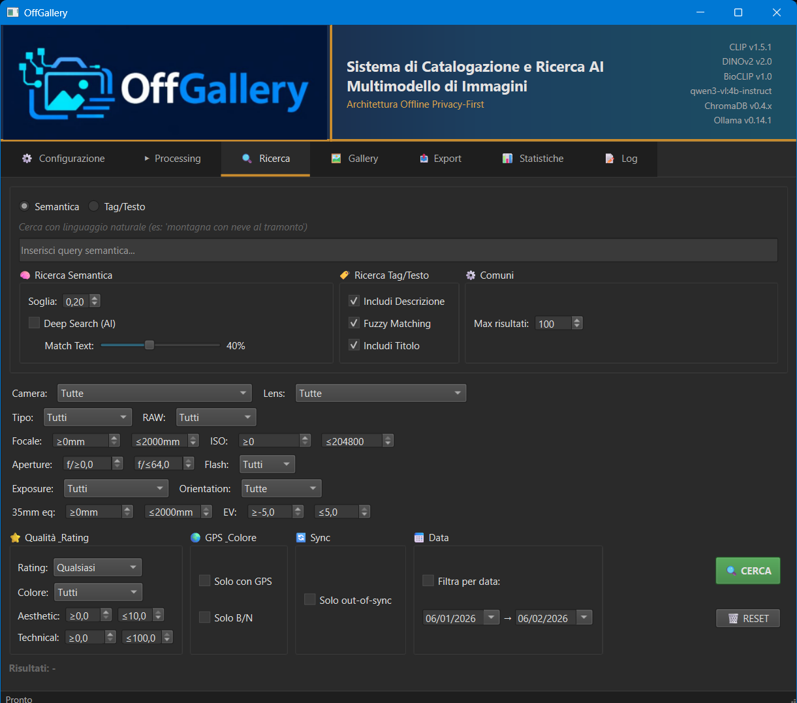

<p align="center">
  
</p>

<h1 align="center">OffGallery</h1>

<p align="center">
  <strong>Sistema di catalogazione intelligente per fotografi, che rispetta la tua privacy</strong>
</p>

<p align="center">
  
  
  
  
  
  
  
  
</p>

<p align="center">
  <em>Analisi semantica ed estetica delle tue foto con AI locale. Zero cloud. Zero compromessi.</em>
</p>

---

> [!NOTE]
> **🔧 Installer Windows + Linux — Hardening Completato**
>
> Tutti i problemi noti di entrambi gli installer sono stati identificati e risolti.
> **Windows**: `CondaToSNonInteractiveError`, mancato salvataggio modelli AI in `Models/`, crash di `from_pretrained` dopo il 100% di caricamento.
> **Linux**: `conda env list` inaffidabile, mancanza di `--override-channels`, percorsi conda incompleti, URL Miniconda hardcoded x86_64, pipefail su `ollama list`.
>
> **In attesa di verifica finale su installazione fresh.** Per problemi durante l'installazione, apri una [Discussion](https://github.com/HEGOM61ita/OffGallery/discussions).

---

## Ultime Novità

| Data | Cosa | Note |
|------|------|------|
| 25 feb 2026 | **Import da catalogo Lightroom + Export con struttura** | Elaborazione direttamente da `.lrcat`; copia file con struttura directory originale multi-disco; destinazione XMP disaccoppiata dalla copia; UI Export semplificata e contestuale |
| 24 feb 2026 | **Geotag geografico offline** | GPS → gerarchia `GeOFF\|Europe\|Italy\|Sardegna\|Città` senza API, visibile nel tooltip gallery e scritto in XMP HierarchicalSubject |
| 23 feb 2026 | **Fix estrazione RAW** | Fallback multi-stadio ExifTool per NEF/ARW high-efficiency; warning nel log se nessuna anteprima disponibile, metadati salvati comunque — [Discussion #11](https://github.com/HEGOM61ita/OffGallery/discussions/11) |
| 22 feb 2026 | **Hardening installer Windows + Linux** | Robustezza conda su tutti i profili, ARM64, ToS bypass, pipefail — [Discussion #9](https://github.com/HEGOM61ita/OffGallery/discussions/9) |
| 20 feb 2026 | **Fix Installer v2** | 13 bug risolti su Windows e Linux — [Discussion #8](https://github.com/HEGOM61ita/OffGallery/discussions/8) |
| 18 feb 2026 | **v0.7 — Supporto Linux** | Installer bash, launcher, config cross-platform — [Discussion #7](https://github.com/HEGOM61ita/OffGallery/discussions/7) |

Storico completo nelle [**Discussions**](https://github.com/HEGOM61ita/OffGallery/discussions).

---

## Perché OffGallery?

Sei un fotografo che vuole catalogare migliaia di immagini RAW senza affidarle a servizi cloud? Vuoi cercare le tue foto con linguaggio naturale ("tramonto con montagne") mantenendo tutto sul tuo PC? **OffGallery è la risposta.**

### Caratteristiche Principali

| Funzionalità | Descrizione |
|--------------|-------------|
| **100% Offline** | Nessun dato lascia mai il tuo computer. Tutti i modelli AI girano localmente |
| **Potente ricerca Semantica /tags/Exif/+vari** | Cerca in ITALIANO con linguaggio naturale e/o combo complesse con traduzione automatica |
| **Supporto RAW Nativo** | 25+ formati RAW supportati (Canon CR2/CR3, Nikon NEF, Sony ARW, Fuji RAF...) |
| **Ricerca similarità visiva** | Un semplice click per trovare immagini simili, doppioni, etc. |
| **Import da catalogo Lightroom** | Elabora direttamente i file indicizzati in un catalogo `.lrcat` come sorgente di input, senza dover specificare cartelle manualmente |
| **Integrazione Lightroom** | Sincronizzazione/export bidirezionale XMP con rating, tag e metadati. Nessun dato proprietario viene modificato |
| **Valutazione Estetica** | Score automatico della qualità artistica (0-10) |
| **Identificazione Specie** | BioCLIP2 riconosce ~450.000 specie con tassonomia completa a 7 livelli |
| **Geotag Offline** | Gerarchia geografica automatica da GPS: paese, regione, città — senza API esterne, dati GeoNames bundled |
| **Statistiche** | Tipologia, Date, Metadati, Attributi, Strumentazione usata, Tempi di posa, Ratings etc. |

<p align="center">
  
</p>

---

## Stack AI Locale

OffGallery orchestra **6 modelli AI** che lavorano insieme, completamente offline:

```
┌─────────────────────────────────────────────────────────────────┐
│                        OFFGALLERY                               │
├─────────────────────────────────────────────────────────────────┤
│  ┌──────────┐  ┌──────────┐  ┌──────────┐  ┌──────────────────┐ │
│  │   CLIP   │  │  DINOv2  │  │ BioCLIP  │  │ LLM Vision       │ │
│  │ Ricerca  │  │Similarità│  │  Flora   │  │ (Qwen3-VL/Ollama)│ │
│  │Semantica │  │  Visiva  │  │  Fauna   │  │ Tag & Descrizioni│ │
│  └──────────┘  └──────────┘  └──────────┘  └──────────────────┘ │
│  ┌──────────────────────┐  ┌────────────────────────────────┐   │
│  │  Aesthetic Predictor │  │  MUSIQ (Technical Quality)     │   │
│  │  Valutazione 0-10    │  │  Analisi nitidezza/rumore      │   │
│  └──────────────────────┘  └────────────────────────────────┘   │
│  ┌──────────────────────────────────────────────────────────┐   │
│  │  Argos Translate (IT→EN) per query multilingue           │   │
│  └──────────────────────────────────────────────────────────┘   │
└─────────────────────────────────────────────────────────────────┘
```

---

## Funzionalità

### Ricerca Intelligente

- **Semantica**: Scrivi quello che cerchi in italiano ("gatto nero sul divano") con esclusivo sistema di accuratezza con slide gui
- **Per Tag**: Ricerca fuzzy con deduplicazione intelligente
- **Filtri EXIF**: Camera, obiettivo, focale, ISO, tempo, diaframma, data, etc.
- **Colore**: Rilevamento automatico B/N con soglia configurabile
- **Rating**: Sistema compatibile Lightroom (0-5 stelle)

<p align="center">
  
</p>

### Analisi Immagini

- **Embedding CLIP**: 512 dimensioni per ricerca semantica
- **Embedding DINOv2**: 768 dimensioni per similarità visiva
- **Tassonomia BioCLIP**: Classificazione automatica specie con 7 livelli tassonomici (campo dedicato, separato dai tag)
- **Gerarchia geografica**: Da coordinate GPS a `GeOFF|Europe|Italy|Sardegna|Città` — offline, dati GeoNames bundled, contestualizza anche i testi LLM
- **Tag LLM**: Descrizioni e tag generati da modelli linguistici locali parametrizzabili
- **Score Estetico**: Valutazione artistica automatica
- **Score Tecnico**: Analisi qualità (nitidezza, rumore, esposizione, solo per non RAW)

### Workflow Fotografico

- **Import da catalogo Lightroom**: Nel tab Elaborazione, seleziona un file `.lrcat` come sorgente — OffGallery legge il catalogo in sola lettura e processa tutti i file indicizzati, mantenendo intatto il catalogo originale
- **Import XMP**: Legge tag e rating da Lightroom/DxO/etc.
- **Export XMP**: Scrive modifiche compatibili con editor esterni, inclusa tassonomia BioCLIP in `HierarchicalSubject`
- **Export gerarchico**: BioCLIP esportato con prefisso `AI|Taxonomy|...` e geotag con prefisso `GeOFF|...` — nessuna interferenza con le keyword utente
- **Copia con struttura**: Copia i file originali mantenendo la gerarchia di cartelle, anche con foto da dischi diversi (Windows: `C_drive/` `D_drive/`, macOS: nome volume, Linux: nome mount point)
- **Destinazione indipendente**: XMP e copia possono avere destinazioni diverse — es. XMP accanto agli originali e copia su disco esterno
- **Sync State**: Traccia stato sincronizzazione (PERFECT_SYNC, DIRTY, etc.)
- **Badge Visivi**: Score, rating, ranking e stato colore nella gallery
- **Ordinamento Gallery**: 7 criteri (rilevanza, data, nome, rating, score estetico/tecnico/composito) con direzione ASC/DESC
- **Menu contestuale**: Per ogni immagine nella Gallery, basta un click per editarla su Lightroom o altro editor, gestire metadati, creare tags e descrizioni, etc.

---

## Requisiti di Sistema

| Componente | Minimo | Consigliato |
|------------|--------|-------------|
| **RAM** | 8 GB | 16 GB |
| **Disco** | 15 GB | 25 GB |
| **GPU** | - | NVIDIA con CUDA |
| **OS** | Windows 10/11, Linux 64-bit o macOS 13+ | Windows 11 / Ubuntu 22.04+ |

> **Note**:
> - GPU NVIDIA raccomandata per prestazioni ottimali. Funziona anche su CPU (più lento)
> - Connessione internet richiesta solo al primo avvio per download modelli AI (~7 GB)
> - **Linux**: testato su Ubuntu, Fedora e Arch. Altre distribuzioni con supporto conda dovrebbero funzionare
> - **macOS**: supportato su Apple Silicon (M1/M2/M3) e Intel. Installer in lavorazione — seguire la procedura di installazione manuale

### WSL2 (Windows Subsystem for Linux)

OffGallery funziona anche su WSL2 con interfaccia grafica tramite **WSLg** (incluso in Windows 11 e Windows 10 aggiornato).

**Requisiti:**
- WSLg attivo (Windows 11 o Windows 10 aggiornato)
- Installa nella home Linux (es. `~/OffGallery`)

Il wizard installa e configura tutto automaticamente.

---

## Installazione

### 1. Scarica OffGallery

**Opzione A - Download ZIP (consigliato):**
1. Clicca il pulsante verde **"<> Code"** in alto a destra
2. Seleziona **"Download ZIP"**
3. Estrai lo ZIP scegliendo la **cartella padre** dove vuoi che risieda OffGallery

> **Attenzione all'estrazione:** lo ZIP contiene già una cartella `OffGallery-main` al suo interno — quella **è** la root dell'app.
> Se fai "Estrai tutto" in una cartella già chiamata `OffGallery`, ottieni `OffGallery\OffGallery-main\` (doppia cartella inutile).
> **Corretto:** estrai in `C:\Programs\` → si crea `C:\Programs\OffGallery-main\`, che puoi rinominare come vuoi (es. `OffGallery`).
> Con **git clone** il problema non esiste: la cartella creata è già la root.

**Opzione B - Git clone:**
```bash
git clone https://github.com/HEGOM61ita/OffGallery.git
```

### 2. Installa con il Wizard

#### Windows

1. Apri la cartella `installer`
2. **Doppio click** su **`INSTALLA_OffGallery.bat`**
3. Segui le istruzioni a schermo

#### Linux

1. Apri un terminale nella cartella OffGallery
2. Esegui:
   ```bash
   bash installer/install_offgallery.sh
   ```
3. Segui le istruzioni a schermo

Il wizard installa automaticamente tutto il necessario: Miniconda, ambiente Python, librerie (+ ExifTool su Linux), e opzionalmente Ollama per le descrizioni AI. Al termine crea un collegamento (Desktop su Windows, menu applicazioni su Linux).

> **Tempo stimato**: 20-40 minuti. Al primo avvio, OffGallery scarica automaticamente i modelli AI (~7 GB). Gli avvii successivi saranno completamente offline.

### Installazione manuale (alternativa)

**Windows** - script batch separati:
1. `installer/01_install_miniconda.bat` - Verifica/installa Miniconda
2. `installer/02_create_env.bat` - Crea ambiente Python
3. `installer/03_install_packages.bat` - Installa librerie
4. `installer/06_setup_ollama.bat` - Ollama + LLM Vision (opzionale)

**Linux** - usa il wizard `install_offgallery.sh` che copre tutti gli step, oppure installa manualmente:
1. Installa [Miniconda](https://docs.anaconda.com/miniconda/install/) per Linux
2. `conda create -n OffGallery python=3.12 -y`
3. `conda run -n OffGallery pip install -r installer/requirements_offgallery.txt`
4. Installa ExifTool: `sudo apt install libimage-exiftool-perl` (Ubuntu/Debian) o equivalente
5. (Opzionale) Installa [Ollama](https://ollama.com/download) e `ollama pull qwen3-vl:4b-instruct`

### Istruzioni Dettagliate

Per una guida passo-passo completa, consulta **[installer/INSTALL_GUIDE.md](installer/INSTALL_GUIDE.md)**.

---

## Utilizzo

### Interfaccia Grafica

L'applicazione presenta 7 tab principali:

| Tab | Funzione |
|-----|----------|
| **Elaborazione** | Processa immagini con tutti i modelli AI. Sorgente: cartella o catalogo Lightroom `.lrcat` |
| **Ricerca** | Query semantica e filtri avanzati |
| **Galleria** | Visualizza risultati con badge, preview e ordinamento intelligente |
| **Statistiche** | Analisi del database e pattern di scatto |
| **Esportazione** | Export XMP, CSV e copia file con struttura directory originale |
| **Configurazione** | Impostazioni modelli, parametri ed editor esterni |
| **Log** | Monitoraggio elaborazioni in tempo reale |

### Esempio di Workflow

1. **Importa**: Scegli una cartella (`INPUT/` predefinita) **oppure seleziona direttamente un catalogo Lightroom `.lrcat`** e avvia il processo
2. **Cerca**: Usa "Ricerca" per trovare le foto ("ritratto controluce") dal database
3. **Visualizza**: Seleziona / edita / gestisci i risultati dalla Gallery
4. **Esporta**: Sincronizza i tag con Lightroom/altri via XMP, o copia i file con struttura originale verso un disco di backup

---

## Configurazione

Per la documentazione completa delle opzioni di configurazione, consulta **[CONFIGURATION.md](CONFIGURATION.md)**.

---

## Architettura

```
offgallery/
├── gui/                      # Moduli interfaccia PyQt6
│   ├── processing_tab.py     # Orchestrazione elaborazione + sorgente catalogo
│   ├── search_tab.py         # Ricerca semantica + filtri
│   ├── gallery_tab.py        # Visualizzazione risultati
│   ├── export_tab.py         # Export XMP/CSV + copia con struttura
│   └── ...
├── embedding_generator.py    # Generazione embedding multi-modello
├── retrieval.py              # Motore di ricerca
├── db_manager_new.py         # Gestione database SQLite
├── raw_processor.py          # Estrazione RAW ottimizzata
├── xmp_manager_extended.py   # Lettura/scrittura XMP
├── geo_enricher.py           # Geolocalizzazione offline GPS → GeOFF
├── catalog_readers/          # Lettori cataloghi esterni
│   └── lightroom_reader.py   # Legge .lrcat (SQLite) → lista file
├── utils/                    # Utility cross-platform
│   ├── paths.py              # Path resolver (script/EXE/WSL)
│   └── copy_helpers.py       # Copia con struttura multi-disco
├── aesthetic/                # Modelli valutazione estetica
├── brisque_models/           # Modelli qualità tecnica
├── exiftool_files/           # ExifTool per metadati EXIF
├── database/                 # Database SQLite
├── INPUT/                    # Cartella import immagini
└── config_new.yaml           # Configurazione
```

---

## Formati Supportati

### Immagini Standard
`JPG` `JPEG` `PNG` `TIFF` `TIF` `WEBP` `BMP`

### Formati RAW
| Produttore | Formati |
|------------|---------|
| **Canon** | CR2, CR3, CRW |
| **Nikon** | NEF, NRW |
| **Sony** | ARW, SRF, SR2 |
| **Fujifilm** | RAF |
| **Panasonic** | RW2 |
| **Olympus/OM** | ORF |
| **Pentax** | PEF, DNG |
| **Leica** | DNG, RWL |
| **Adobe** | DNG |
| **Altri** | 3FR, IIQ, RWL, X3F |

---

## Privacy e Sicurezza

OffGallery è progettato con la privacy come principio fondamentale:

- **Zero telemetria**: Nessun dato viene raccolto o inviato
- **Offline dopo primo avvio**: Al primo avvio i modelli AI vengono scaricati dal repository HuggingFace congelato. Dopo il download, l'app funziona completamente offline
- **Repository congelato**: I modelli sono hostati su un repository controllato (`HEGOM/OffGallery-models`) per garantire stabilità e compatibilità delle versioni
- **Storage locale**: Database SQLite + embedding in formato binario
- **Nessuna API key**: Non servono account o abbonamenti

---

## Roadmap

Questo progetto è in sviluppo attivo. Tutte le funzionalità e migliorie sono aggiunte gradualmente senza una roadmap pubblica.

---

## Contributi e Feedback

Questo progetto segue un modello di sviluppo centralizzato.
Attualmente, non sono accettati contributi di codice esterno (pull requests).

Segnalazioni di bug, idee e suggerimenti per nuove funzionalità sono benvenuti nelle [**Discussions**](https://github.com/HEGOM61ita/OffGallery/discussions) del progetto. In particolare, sono apprezzati feedback sulle prestazioni con la descrizione dell'hardware utilizzato (GPU, RAM, modello Ollama) per migliorare l'ottimizzazione su diverse configurazioni.

---

## Support Policy

Questo progetto è fornito "as-is".
Non ho la possibilità di provvedere per un supporto individuale, risoluzione di problemi o assistenza nell'installazione.
Si prega di far riferimento alla documentazione.
Segnalazioni che descrivono chiaramente errori riproducibili saranno esaminate appena possibile.

---

## Licenza e Note Legali

Distribuito sotto licenza **AGPL-3.0**. Vedi `LICENSE` per maggiori informazioni.

- **[TRADEMARK.md](TRADEMARK.md)** - Informazioni sui marchi registrati
- **[THIRD_PARTY.md](THIRD_PARTY.md)** - Licenze e attribuzioni software di terze parti

---

## Ringraziamenti

- [OpenAI CLIP](https://github.com/openai/CLIP) - Ricerca semantica
- [Meta DINOv2](https://github.com/facebookresearch/dinov2) - Embedding visivi
- [BioCLIP](https://github.com/Imageomics/bioclip) - Classificazione flora/fauna
- [Ollama](https://ollama.ai/) - LLM locali
- [ExifTool](https://exiftool.org/) - Metadati EXIF/XMP
- [PyQt6](https://www.riverbankcomputing.com/software/pyqt/) - Framework UI

---

<p align="center">
  <strong>Fatto con passione per i fotografi che tengono alla loro privacy</strong>
</p>

<p align="center">
  <a href="#offgallery">Torna su</a>
</p>
