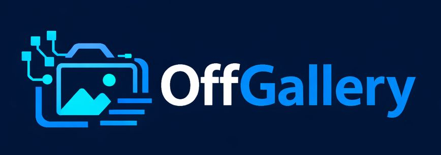
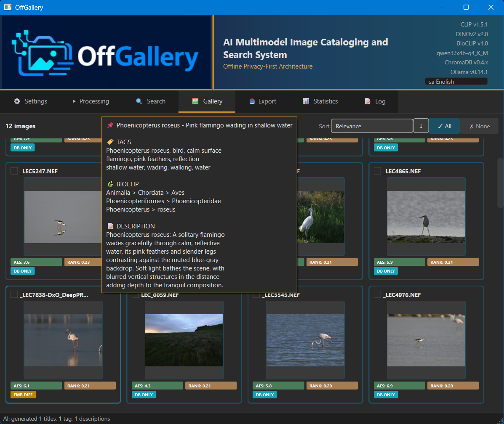

<p align="center">
  <a href="#italiano">🇮🇹 Italiano</a> &nbsp;|&nbsp; <a href="#english">🇬🇧 English</a>
</p>

<p align="center">
  
</p>

<h1 align="center">OffGallery</h1>

<p align="center">
  <strong>Sistema di catalogazione intelligente per fotografi, che rispetta la tua privacy</strong>
</p>

<p align="center">
  
  
  
  
  
  
  
  
</p>

<p align="center">
  <em>Analisi semantica ed estetica delle tue foto con AI locale. Zero cloud. Zero compromessi.</em>
</p>

<a id="italiano"></a>

---

> [!NOTE]
> **🌍 Supporto multilingua completo**
>
> OffGallery supporta ora 6 lingue (**IT, EN, FR, DE, ES, PT**) a tutti i livelli, in modo indipendente:
>
> - **Interfaccia grafica**: seleziona la lingua dal tab Configurazione → Lingua interfaccia
> - **Contenuti generati da LLM** (tag, descrizioni, titoli): scegli la lingua di output LLM indipendentemente dalla GUI. I tag vengono generati nella lingua configurata e salvati così nel database
> - **Ricerca semantica CLIP**: funziona sempre in inglese internamente (massima accuratezza), con traduzione automatica della query — trasparente per l'utente
> - **Ricerca per tag/keyword**: la query viene automaticamente tradotta nella lingua dei tag (la stessa `llm_output_language`) prima del matching, garantendo risultati corretti anche con tag in francese, tedesco, ecc.
>
> Le traduzioni avvengono tramite **Argostranslate** completamente offline. I pacchetti di traduzione vengono scaricati al primo avvio se necessari; un messaggio nel pannello Log informa l'utente sullo stato.

---

## Ultime Novità

| Data | Cosa | Note |
|------|------|------|
| 7 mar 2026 | **Supporto multilingua completo** | GUI, LLM output e ricerca tag ora indipendenti: 6 lingue (IT/EN/FR/DE/ES/PT), traduzione query automatica Argostranslate offline |
| 5 mar 2026 | **Fix segfault macOS al primo avvio** | Il launcher macOS scarica ora i modelli AI in un processo separato prima di avviare Qt, eliminando il crash "Segmentation fault: 11" che si verificava al primo avvio su tutti i Mac |
| 3 mar 2026 | **Ricerche salvate** | Salva e richiama configurazioni di ricerca complete (query, mode, soglia, tutti i filtri EXIF/score/date) con un click; archivio in `database/saved_searches.json` |
| 3 mar 2026 | **Nuovo modello LLM Vision: Qwen3.5 4B** | Migrazione a `qwen3.5:4b-q4_K_M` (early fusion); descrizioni più ricche; prompt ottimizzato: specie da BioCLIP, toponymi tradotti in italiano, parametri generation aggiornati (`num_ctx: 4096`, `top_k: 40`) |
| 1 mar 2026 | **Installer macOS** | Wizard completo per Intel e Apple Silicon; Homebrew per ExifTool e Ollama; PyTorch con MPS per GPU Metal; `OffGallery.app` in `~/Applications` cercabile via Spotlight e Launchpad; percorso Miniconda configurabile dal wizard su Windows |
| 10 mar 2026 | **Modalità "Solo Gen. AI"** | Nel tab Elaborazione, nuova opzione accanto a "Riprocessa tutte" per aggiornare tag, descrizione e titolo (LLM) solo sulle immagini già nel database, saltando EXIF ed embedding — utile per riscansionare una cartella con un modello LLM migliore senza rifare tutta l'analisi |
| 25 feb 2026 | **Import da catalogo Lightroom + Export con struttura** | Elaborazione direttamente da `.lrcat`; copia file con struttura directory originale multi-disco; destinazione XMP disaccoppiata dalla copia; UI Export semplificata e contestuale |

Storico completo nelle [**Discussions**](https://github.com/HEGOM61ita/OffGallery/discussions).

---

## Perché OffGallery?

Sei un fotografo che vuole catalogare migliaia di immagini RAW senza affidarle a servizi cloud? Vuoi cercare le tue foto con linguaggio naturale ("tramonto con montagne") mantenendo tutto sul tuo PC? **OffGallery è la risposta.**

### Caratteristiche Principali

| Funzionalità | Descrizione |
|--------------|-------------|
| **100% Offline** | Nessun dato lascia mai il tuo computer. Tutti i modelli AI girano localmente |
| **Supporto multilingua** | GUI, output LLM e ricerca tag indipendenti: 6 lingue (IT, EN, FR, DE, ES, PT). Tag e descrizioni nella lingua che preferisci, anche diversa dalla lingua dell'interfaccia |
| **Potente ricerca Semantica /tags/Exif/+vari** | Cerca con linguaggio naturale e/o combo complesse; traduzione automatica query per CLIP (EN) e per tag (lingua contenuti); salva e richiama ricerche preferite in un click |
| **Supporto RAW Nativo** | 25+ formati RAW supportati (Canon CR2/CR3, Nikon NEF, Sony ARW, Fuji RAF...) |
| **Ricerca similarità visiva** | Un semplice click per trovare immagini simili, doppioni, etc. |
| **Import da catalogo Lightroom** | Elabora direttamente i file indicizzati in un catalogo `.lrcat` come sorgente di input, senza dover specificare cartelle manualmente |
| **Integrazione Lightroom** | Sincronizzazione/export bidirezionale XMP con rating, tag e metadati. Nessun dato proprietario viene modificato |
| **Valutazione Estetica** | Score automatico della qualità artistica (0-10) |
| **Identificazione Specie** | BioCLIP2 riconosce ~450.000 specie con tassonomia completa a 7 livelli |
| **Geotag Offline** | Gerarchia geografica automatica da GPS: paese, regione, città — senza API esterne, dati GeoNames bundled |
| **Statistiche** | Tipologia, Date, Metadati, Attributi, Strumentazione usata, Tempi di posa, Ratings etc. |

<p align="center">
  
</p>

---

## Motori di Analisi

Tutti i componenti girano localmente, completamente offline:

```
┌─────────────────────────────────────────────────────────────────┐
│                        OFFGALLERY                               │
├─────────────────────────────────────────────────────────────────┤
│  ┌──────────┐  ┌──────────┐  ┌──────────┐  ┌──────────────────┐ │
│  │   CLIP   │  │  DINOv2  │  │ BioCLIP  │  │ LLM Vision       │ │
│  │ Ricerca  │  │Similarità│  │  Flora   │  │ (Qwen3.5/Ollama) │ │
│  │Semantica │  │  Visiva  │  │  Fauna   │  │ Tag & Descrizioni│ │
│  └──────────┘  └──────────┘  └──────────┘  └──────────────────┘ │
│  ┌──────────────────────┐  ┌────────────────────────────────┐   │
│  │  Aesthetic Predictor │  │  MUSIQ (Technical Quality)     │   │
│  │  Valutazione 0-10    │  │  Analisi nitidezza/rumore      │   │
│  └──────────────────────┘  └────────────────────────────────┘   │
│  ┌──────────────────────────┐  ┌──────────────────────────┐   │
│  │  Argos Translate         │  │  Geocoding Inverso       │   │
│  │  Query EN + tag lingua   │  │  GPS → Paese/Regione/Città│   │
│  └──────────────────────────┘  └──────────────────────────┘   │
└─────────────────────────────────────────────────────────────────┘
```

---

## Funzionalità

OffGallery offre ricerca semantica, analisi immagini con più modelli AI, workflow completo con Lightroom e export XMP. Consulta il **[Manuale Utente completo →](docs/USER_MANUAL_IT.html)** per la descrizione dettagliata di ogni funzione, tab e opzione.

| Funzione | Descrizione rapida |
|----------|--------------------|
| **Ricerca Semantica** | Linguaggio naturale, traduzione automatica offline, cursore di soglia |
| **Ricerca per Tag** | Fuzzy matching case-insensitive, ricerche salvate |
| **Filtri Avanzati** | Camera, obiettivo, ISO, diaframma, tempo, data, rating, score, colore |
| **Analisi AI** | CLIP · DINOv2 · BioCLIP2 · LLM Vision · Score Estetico · Score Tecnico · Geotag |
| **Workflow Lightroom** | Import `.lrcat` · Import XMP · Export XMP gerarchico · Copia con struttura |
| **Solo Gen. AI** | Rigenera solo tag/descrizione/titolo LLM su foto già nel DB, salta EXIF ed embedding |

---

## Requisiti di Sistema

| Componente | Minimo | Consigliato |
|------------|--------|-------------|
| **RAM** | 8 GB | 16 GB |
| **Disco** | 14 GB (CPU) / 18 GB (NVIDIA GPU) | 20 GB |
| **GPU** | - | NVIDIA con CUDA |
| **OS** | Windows 10/11, Linux 64-bit o macOS 12+ | Windows 11 / Ubuntu 22.04+ / macOS 13+ |

> **Note**:
> - GPU NVIDIA raccomandata per prestazioni ottimali. Funziona anche su CPU (più lento)
> - **Spazio disco**: l'ambiente Python occupa ~3.5 GB senza GPU, ~7 GB con NVIDIA (PyTorch CUDA + runtime libraries). I modelli AI pesano ~6.7 GB indipendentemente dalla GPU
> - Connessione internet richiesta solo al primo avvio per download modelli AI (~6.7 GB)
> - **Linux**: testato su Ubuntu, Fedora e Arch. Altre distribuzioni con supporto conda dovrebbero funzionare
> - **macOS**: supportato su Apple Silicon (M1/M2/M3/M4) e Intel (x86_64). Su Apple Silicon PyTorch usa Metal/MPS senza CUDA

### WSL2 (Windows Subsystem for Linux)

OffGallery funziona anche su WSL2 con interfaccia grafica tramite **WSLg** (incluso in Windows 11 e Windows 10 aggiornato).

**Requisiti:**
- WSLg attivo (Windows 11 o Windows 10 aggiornato)
- Installa nella home Linux (es. `~/OffGallery`)

Il wizard installa e configura tutto automaticamente.

---

## Installazione

### 1. Scarica OffGallery

**Opzione A - Download ZIP (consigliato):**
1. Clicca il pulsante verde **"<> Code"** in alto a destra
2. Seleziona **"Download ZIP"**
3. Estrai lo ZIP scegliendo la **cartella padre** dove vuoi che risieda OffGallery

> **Attenzione all'estrazione:** lo ZIP contiene già una cartella `OffGallery-main` al suo interno — quella **è** la root dell'app.
> Se fai "Estrai tutto" in una cartella già chiamata `OffGallery`, ottieni `OffGallery\OffGallery-main\` (doppia cartella inutile).
> **Corretto:** estrai in `C:\Programs\` → si crea `C:\Programs\OffGallery-main\`, che puoi rinominare come vuoi (es. `OffGallery`).
> Con **git clone** il problema non esiste: la cartella creata è già la root.

**Opzione B - Git clone:**
```bash
git clone https://github.com/HEGOM61ita/OffGallery.git
```

### 2. Installa con il Wizard

#### Windows

1. Apri la cartella `installer`
2. **Doppio click** su **`INSTALLA_OffGallery.bat`**
3. Segui le istruzioni a schermo

#### Linux

1. Apri un terminale nella cartella OffGallery
2. Esegui:
   ```bash
   bash installer/install_offgallery.sh
   ```
3. Segui le istruzioni a schermo

#### macOS

1. Apri un terminale nella cartella OffGallery
2. Esegui:
   ```bash
   bash installer/install_offgallery_mac.sh
   ```
3. Segui le istruzioni a schermo

> **Apple Silicon (M1/M2/M3/M4)**: PyTorch utilizza automaticamente Metal/MPS per l'accelerazione GPU — nessuna configurazione aggiuntiva necessaria.
>
> **Nota Gatekeeper**: al primo avvio di `OffGallery.app` o `OffGallery.command`, macOS potrebbe mostrare un avviso di sicurezza. Usa **tasto destro → Apri** per confermarlo. L'installer rimuove già l'attributo quarantine automaticamente, quindi l'avviso normalmente non compare.

Il wizard installa automaticamente tutto il necessario: Miniconda, ambiente Python, librerie, ExifTool e opzionalmente Ollama per le descrizioni AI. Al termine crea un collegamento per avviare l'app (`.lnk` sul Desktop su Windows, voce nel menu applicazioni su Linux, `OffGallery.app` in `~/Applications` cercabile via Spotlight e Launchpad su macOS).

> **Tempo stimato**: 20-40 minuti. Al primo avvio, OffGallery scarica automaticamente i modelli AI (~6.7 GB). Gli avvii successivi saranno completamente offline.

### Installazione manuale (alternativa)

**Windows** - script batch separati:
1. `installer/01_install_miniconda.bat` - Verifica/installa Miniconda
2. `installer/02_create_env.bat` - Crea ambiente Python
3. `installer/03_install_packages.bat` - Installa librerie
4. `installer/06_setup_ollama.bat` - Ollama + LLM Vision (opzionale)

**Linux** - usa il wizard `install_offgallery.sh` che copre tutti gli step, oppure installa manualmente:
1. Installa [Miniconda](https://docs.anaconda.com/miniconda/install/) per Linux
2. `conda create -n OffGallery python=3.12 --override-channels -c conda-forge -y`
3. `conda run -n OffGallery pip install -r installer/requirements_offgallery.txt`
4. Installa ExifTool: `sudo apt install libimage-exiftool-perl` (Ubuntu/Debian) o equivalente
5. (Opzionale) Installa [Ollama](https://ollama.com/download) e `ollama pull qwen3.5:4b-q4_K_M`

**macOS** - usa il wizard `install_offgallery_mac.sh` che copre tutti gli step, oppure installa manualmente:
1. Installa [Miniconda](https://docs.anaconda.com/miniconda/install/) per macOS (scegli la versione arm64 per Apple Silicon, x86_64 per Intel)
2. `conda create -n OffGallery python=3.12 --override-channels -c conda-forge -y`
3. `conda run -n OffGallery pip install -r installer/requirements_offgallery.txt`
4. Installa ExifTool: `brew install exiftool` (richiede [Homebrew](https://brew.sh)) o scarica il `.pkg` da [exiftool.org](https://exiftool.org)
5. (Opzionale) Installa [Ollama](https://ollama.com/download) e `ollama pull qwen3.5:4b-q4_K_M`
6. Avvia: `conda run -n OffGallery python gui_launcher.py`

### Istruzioni Dettagliate

Per una guida passo-passo completa, consulta **[installer/INSTALL_GUIDE.md](installer/INSTALL_GUIDE.md)**.

---

## Utilizzo

L'interfaccia ha 7 tab: **Elaborazione · Ricerca · Galleria · Statistiche · Esportazione · Configurazione · Log**.

Workflow tipico: importa una cartella o un catalogo `.lrcat` → elabora con AI → cerca con linguaggio naturale → esporta XMP verso Lightroom.

### Avviare OffGallery

| Sistema | Metodo consigliato |
|---------|-------------------|
| **Windows** | Doppio click sul collegamento **OffGallery.lnk** creato sul Desktop dall'installer |
| **macOS** | Apri **OffGallery.app** da `~/Applications` o cerca con Spotlight |
| **Linux** | Usa la voce nel menu applicazioni, oppure `bash installer/offgallery_launcher.sh` dalla cartella dell'app |

> **Attenzione (Windows):** non copiare o spostare `OffGallery_Launcher.bat` sul Desktop o in altre cartelle — il file `.bat` usa il suo percorso per trovare l'applicazione e non funziona se spostato. Usa sempre il **collegamento** `.lnk` creato dall'installer, che punta al `.bat` originale. Se hai perso il collegamento: tasto destro su `installer\OffGallery_Launcher.bat` → **Invia a → Desktop (crea collegamento)**.

> **Manuale Utente completo (IT):** **[docs/USER_MANUAL_IT.html](docs/USER_MANUAL_IT.html)**
> — Descrizione dettagliata di ogni tab, opzione, badge, concetti avanzati (BioCLIP, geotag, sync state) e troubleshooting.

---

## Configurazione

Per la documentazione completa delle opzioni di configurazione, consulta **[CONFIGURATION.md](CONFIGURATION.md)**.

---

## Architettura

```
offgallery/
├── gui/                      # Moduli interfaccia PyQt6
│   ├── processing_tab.py     # Orchestrazione elaborazione + sorgente catalogo
│   ├── search_tab.py         # Ricerca semantica + filtri
│   ├── gallery_tab.py        # Visualizzazione risultati
│   ├── export_tab.py         # Export XMP/CSV + copia con struttura
│   └── ...
├── embedding_generator.py    # Generazione embedding multi-modello
├── retrieval.py              # Motore di ricerca
├── db_manager_new.py         # Gestione database SQLite
├── raw_processor.py          # Estrazione RAW ottimizzata
├── xmp_manager_extended.py   # Lettura/scrittura XMP
├── geo_enricher.py           # Geolocalizzazione offline GPS → GeOFF
├── catalog_readers/          # Lettori cataloghi esterni
│   └── lightroom_reader.py   # Legge .lrcat (SQLite) → lista file
├── utils/                    # Utility cross-platform
│   ├── paths.py              # Path resolver (script/EXE/WSL)
│   └── copy_helpers.py       # Copia con struttura multi-disco
├── aesthetic/                # Modelli valutazione estetica
├── brisque_models/           # Modelli qualità tecnica
├── exiftool_files/           # ExifTool per metadati EXIF
├── database/                 # Database SQLite
├── INPUT/                    # Cartella import immagini
└── config_new.yaml           # Configurazione
```

---

## Formati Supportati

### Immagini Standard
`JPG` `JPEG` `PNG` `TIFF` `TIF` `WEBP` `BMP`

### Formati RAW
| Produttore | Formati |
|------------|---------|
| **Canon** | CR2, CR3, CRW |
| **Nikon** | NEF, NRW |
| **Sony** | ARW, SRF, SR2 |
| **Fujifilm** | RAF |
| **Panasonic** | RW2 |
| **Olympus/OM** | ORF |
| **Pentax** | PEF, DNG |
| **Leica** | DNG, RWL |
| **Adobe** | DNG |
| **Altri** | 3FR, IIQ, X3F |

---

## Privacy e Sicurezza

OffGallery è progettato con la privacy come principio fondamentale:

- **Zero telemetria**: Nessun dato viene raccolto o inviato
- **Offline dopo primo avvio**: Al primo avvio i modelli AI vengono scaricati dal repository HuggingFace congelato. Dopo il download, l'app funziona completamente offline
- **Repository congelato**: I modelli sono hostati su un repository controllato (`HEGOM/OffGallery-models`) per garantire stabilità e compatibilità delle versioni
- **Storage locale**: Database SQLite + embedding in formato binario
- **Nessuna API key**: Non servono account o abbonamenti

---

## Roadmap

Questo progetto è in sviluppo attivo. Tutte le funzionalità e migliorie sono aggiunte gradualmente senza una roadmap pubblica.

---

## Contributi e Feedback

Questo progetto segue un modello di sviluppo centralizzato.
Attualmente, non sono accettati contributi di codice esterno (pull requests).

Segnalazioni di bug, idee e suggerimenti per nuove funzionalità sono benvenuti nelle [**Discussions**](https://github.com/HEGOM61ita/OffGallery/discussions) del progetto. In particolare, sono apprezzati feedback sulle prestazioni con la descrizione dell'hardware utilizzato (GPU, RAM, modello Ollama) per migliorare l'ottimizzazione su diverse configurazioni.

---

## Support Policy

Questo progetto è fornito "as-is".
Non ho la possibilità di provvedere per un supporto individuale, risoluzione di problemi o assistenza nell'installazione.
Si prega di far riferimento alla documentazione.
Segnalazioni che descrivono chiaramente errori riproducibili saranno esaminate appena possibile.

---

## Licenza e Note Legali

Distribuito sotto licenza **AGPL-3.0**. Vedi `LICENSE` per maggiori informazioni.

- **[TRADEMARK.md](TRADEMARK.md)** - Informazioni sui marchi registrati
- **[THIRD_PARTY.md](THIRD_PARTY.md)** - Licenze e attribuzioni software di terze parti

---

## Ringraziamenti

- [OpenAI CLIP](https://github.com/openai/CLIP) - Ricerca semantica
- [Meta DINOv2](https://github.com/facebookresearch/dinov2) - Embedding visivi
- [BioCLIP](https://github.com/Imageomics/bioclip) - Classificazione flora/fauna
- [Ollama](https://ollama.com) - LLM locali
- [ExifTool](https://exiftool.org/) - Metadati EXIF/XMP
- [PyQt6](https://www.riverbankcomputing.com/software/pyqt/) - Framework UI

---

<p align="center">
  <strong>Fatto con passione per i fotografi che tengono alla loro privacy</strong>
</p>

<p align="center">
  <a href="#offgallery">Torna su</a> &nbsp;|&nbsp; <a href="#english">🇬🇧 English version below</a>
</p>

---

<a id="english"></a>

<p align="center">
  
</p>

<h1 align="center">OffGallery</h1>

<p align="center">
  <strong>Intelligent AI photo cataloging for photographers who care about their privacy</strong>
</p>

<p align="center">
  
  
  
  
  
  
  
  
</p>

<p align="center">
  <em>Semantic and aesthetic analysis of your photos with local AI. Zero cloud. Zero compromises.</em>
</p>

---

> [!NOTE]
> **🌍 Full Multilingual Support**
>
> OffGallery supports 6 languages (**IT, EN, FR, DE, ES, PT**) independently at every level:
>
> - **GUI language**: select your language in Configuration → Interface Language
> - **LLM output language** (tags, descriptions, titles): choose independently from the GUI language. Tags are generated and stored in the configured language
> - **CLIP semantic search**: always runs in English internally (maximum accuracy) with automatic transparent query translation
> - **Tag/keyword search**: query is automatically translated to the tag language (same as `llm_output_language`) before matching, ensuring correct results even with tags in French, German, etc.
>
> All translations use **Argostranslate** — completely offline. Translation packages are downloaded on first use; the Log panel notifies you of their status.

---

## What is OffGallery?

A photographer's tool to catalog thousands of RAW images without sending them to any cloud service. Search your photos with natural language ("sunset over mountains") while keeping everything on your own machine.

### Key Features

| Feature | Description |
|---------|-------------|
| **100% Offline** | No data ever leaves your computer. All AI models run locally |
| **Multilingual** | GUI, LLM output and tag search are independent: 6 languages (IT, EN, FR, DE, ES, PT). Tags and descriptions in any language, different from the UI language if you prefer |
| **Powerful Search** | Natural language semantic search + tag/EXIF/score filters; automatic query translation for CLIP (EN) and tag matching (content language); save and recall favorite searches in one click |
| **Native RAW Support** | 25+ RAW formats (Canon CR2/CR3, Nikon NEF, Sony ARW, Fuji RAF…) |
| **Visual Similarity** | One click to find similar images or near-duplicates |
| **Lightroom Catalog Import** | Process files directly from a `.lrcat` catalog — read-only, no catalog modification |
| **Lightroom Integration** | Bidirectional XMP sync: ratings, tags, metadata. No proprietary data is modified |
| **Aesthetic Scoring** | Automatic artistic quality score (0–10) |
| **Species Identification** | BioCLIP2 recognizes ~450,000 species with full 7-level taxonomy |
| **Offline Geotagging** | Automatic geographic hierarchy from GPS: continent, country, region, city — no external API, bundled GeoNames data |
| **Statistics** | Camera, dates, metadata, gear, exposure, ratings and more |

---

## AI Engines

All components run locally, completely offline:

```
┌─────────────────────────────────────────────────────────────────┐
│                        OFFGALLERY                               │
├─────────────────────────────────────────────────────────────────┤
│  ┌──────────┐  ┌──────────┐  ┌──────────┐  ┌──────────────────┐ │
│  │   CLIP   │  │  DINOv2  │  │ BioCLIP  │  │ LLM Vision       │ │
│  │ Semantic │  │  Visual  │  │  Flora   │  │ (Qwen3.5/Ollama) │ │
│  │  Search  │  │Similarity│  │  Fauna   │  │ Tags & Captions  │ │
│  └──────────┘  └──────────┘  └──────────┘  └──────────────────┘ │
│  ┌──────────────────────┐  ┌────────────────────────────────┐   │
│  │  Aesthetic Predictor │  │  MUSIQ (Technical Quality)     │   │
│  │  Artistic score 0-10 │  │  Sharpness / noise analysis    │   │
│  └──────────────────────┘  └────────────────────────────────┘   │
│  ┌──────────────────────────┐  ┌──────────────────────────┐   │
│  │  Argos Translate         │  │  Reverse Geocoding       │   │
│  │  EN query + tag language │  │  GPS → Country/Region/City│   │
│  └──────────────────────────┘  └──────────────────────────┘   │
└─────────────────────────────────────────────────────────────────┘
```

---

## Features

OffGallery provides semantic search, multi-model AI image analysis, full Lightroom workflow and XMP export. See the **[Full User Manual →](docs/USER_MANUAL_EN.html)** for a detailed description of every feature, tab and option.

| Feature | Quick description |
|---------|-------------------|
| **Semantic Search** | Natural language, automatic offline translation, threshold slider |
| **Tag Search** | Case-insensitive fuzzy matching, saved searches |
| **Advanced Filters** | Camera, lens, ISO, aperture, shutter, date, rating, score, colour |
| **AI Analysis** | CLIP · DINOv2 · BioCLIP2 · LLM Vision · Aesthetic Score · Technical Score · Geotag |
| **Lightroom Workflow** | `.lrcat` import · XMP import · Hierarchical XMP export · Structured copy |
| **AI Gen. Only** | Regenerate tags/description/title (LLM) on existing DB photos, skip EXIF and embeddings |

---

## System Requirements

| Component | Minimum | Recommended |
|-----------|---------|-------------|
| **RAM** | 8 GB | 16 GB |
| **Disk** | 14 GB (CPU) / 18 GB (NVIDIA GPU) | 20 GB |
| **GPU** | — | NVIDIA with CUDA |
| **OS** | Windows 10/11, Linux 64-bit or macOS 12+ | Windows 11 / Ubuntu 22.04+ / macOS 13+ |

> **Notes**:
> - NVIDIA GPU recommended for best performance. CPU-only works but is slower
> - **Disk space**: Python environment ~3.5 GB without GPU, ~7 GB with NVIDIA (PyTorch CUDA + runtime). AI models ~6.7 GB regardless of GPU
> - Internet required only on first launch to download AI models (~6.7 GB); fully offline afterwards
> - **macOS**: Apple Silicon (M1/M2/M3/M4) and Intel supported. PyTorch uses Metal/MPS on Apple Silicon — no CUDA needed

---

## Installation

### 1. Download OffGallery

**Option A — Download ZIP (recommended):**
1. Click the green **"<> Code"** button at the top right
2. Select **"Download ZIP"**
3. Extract to the **parent folder** where you want OffGallery to live

> **Extraction note:** the ZIP already contains an `OffGallery-main` folder — that folder **is** the app root.
> Extract to e.g. `C:\Programs\` → you get `C:\Programs\OffGallery-main\`, which you can rename freely.

**Option B — Git clone:**
```bash
git clone https://github.com/HEGOM61ita/OffGallery.git
```

### 2. Install with the Wizard

#### Windows
1. Open the `installer` folder
2. **Double-click** **`INSTALLA_OffGallery.bat`**
3. Follow the on-screen instructions

#### Linux
```bash
bash installer/install_offgallery.sh
```

#### macOS
```bash
bash installer/install_offgallery_mac.sh
```

> **Apple Silicon (M1/M2/M3/M4)**: PyTorch automatically uses Metal/MPS for GPU acceleration — no extra configuration needed.

The wizard installs everything automatically: Miniconda, Python environment, libraries, ExifTool and optionally Ollama for AI descriptions. On completion it creates a launcher shortcut (Desktop `.lnk` on Windows, application menu entry on Linux, `OffGallery.app` in `~/Applications` on macOS).

> **Estimated time**: 20–40 minutes. On first launch OffGallery downloads AI models (~6.7 GB). All subsequent launches are fully offline.

### Manual installation

**Linux:**
1. Install [Miniconda](https://docs.anaconda.com/miniconda/install/) for Linux
2. `conda create -n OffGallery python=3.12 --override-channels -c conda-forge -y`
3. `conda run -n OffGallery pip install -r installer/requirements_offgallery.txt`
4. Install ExifTool: `sudo apt install libimage-exiftool-perl` (Ubuntu/Debian) or equivalent
5. (Optional) Install [Ollama](https://ollama.com/download) and `ollama pull qwen3.5:4b-q4_K_M`

**macOS:**
1. Install [Miniconda](https://docs.anaconda.com/miniconda/install/) for macOS (arm64 for Apple Silicon, x86_64 for Intel)
2. `conda create -n OffGallery python=3.12 --override-channels -c conda-forge -y`
3. `conda run -n OffGallery pip install -r installer/requirements_offgallery.txt`
4. Install ExifTool: `brew install exiftool`
5. (Optional) Install [Ollama](https://ollama.com/download) and `ollama pull qwen3.5:4b-q4_K_M`

For a full step-by-step guide see **[installer/INSTALL_GUIDE.md](installer/INSTALL_GUIDE.md)**.

---

## Latest News

| Date | What | Notes |
|------|------|-------|
| 10 Mar 2026 | **"AI Gen. Only" mode** | New checkbox next to "Reprocess all" in the Processing tab — reruns LLM (tags, description, title) only on photos already in the database, skipping EXIF and embedding. Useful for updating content with a better LLM without redoing the full analysis |
| 7 Mar 2026 | **Full multilingual support** | GUI, LLM output and tag search independently configurable: 6 languages (IT/EN/FR/DE/ES/PT), automatic offline query translation via Argostranslate |
| 5 Mar 2026 | **macOS first-launch segfault fix** | The macOS launcher now downloads AI models in a separate process before starting Qt, eliminating the "Segmentation fault: 11" crash on first launch on all Macs |
| 3 Mar 2026 | **Saved searches** | Save and recall complete search configurations (query, mode, threshold, all EXIF/score/date filters) in one click; archive in `database/saved_searches.json` |
| 3 Mar 2026 | **New LLM Vision model: Qwen3.5 4B** | Migration to `qwen3.5:4b-q4_K_M` (early fusion); richer descriptions; optimised prompt with BioCLIP species and Italian place names |
| 1 Mar 2026 | **macOS installer** | Full wizard for Intel and Apple Silicon; Homebrew for ExifTool and Ollama; PyTorch with MPS for Metal GPU; `OffGallery.app` in `~/Applications` |
| 25 Feb 2026 | **Lightroom catalog import + structured export** | Process directly from `.lrcat`; copy files preserving original multi-disk directory structure; XMP destination decoupled from file copy |

Full history in [**Discussions**](https://github.com/HEGOM61ita/OffGallery/discussions).

---

## Usage

The interface has 7 tabs: **Processing · Search · Gallery · Statistics · Export · Configuration · Log**.

Typical workflow: import a folder or `.lrcat` catalog → process with AI → search with natural language → export XMP to Lightroom.

### Launching OffGallery

| OS | Recommended method |
|----|-------------------|
| **Windows** | Double-click the **OffGallery.lnk** shortcut created on the Desktop by the installer |
| **macOS** | Open **OffGallery.app** from `~/Applications` or search via Spotlight |
| **Linux** | Use the application menu entry, or run `bash installer/offgallery_launcher.sh` from the app folder |

> **Windows note:** do not copy or move `OffGallery_Launcher.bat` to the Desktop or any other folder — the `.bat` uses its own location to find the application and will fail if moved. Always use the `.lnk` **shortcut** created by the installer, which points to the original `.bat`. If you lost the shortcut: right-click `installer\OffGallery_Launcher.bat` → **Send to → Desktop (create shortcut)**.

> **Full User Manual (EN):** **[docs/USER_MANUAL_EN.html](docs/USER_MANUAL_EN.html)**
> — Detailed description of every tab, option, badge, advanced concepts (BioCLIP, geotagging, sync state) and troubleshooting.

---

## Supported Formats

**Standard:** `JPG` `JPEG` `PNG` `TIFF` `TIF` `WEBP` `BMP`

**RAW:**

| Manufacturer | Formats |
|-------------|---------|
| **Canon** | CR2, CR3, CRW |
| **Nikon** | NEF, NRW |
| **Sony** | ARW, SRF, SR2 |
| **Fujifilm** | RAF |
| **Panasonic** | RW2 |
| **Olympus/OM** | ORF |
| **Pentax** | PEF, DNG |
| **Leica** | DNG, RWL |
| **Adobe** | DNG |
| **Others** | 3FR, IIQ, X3F |

---

## Privacy & Security

OffGallery is built with privacy as a core principle:

- **Zero telemetry**: No data is collected or transmitted
- **Offline after first launch**: AI models are downloaded from a frozen HuggingFace repository on first launch. After that the app runs completely offline
- **Frozen repository**: Models are hosted on a controlled repository (`HEGOM/OffGallery-models`) to guarantee version stability and compatibility
- **Local storage**: SQLite database + binary embeddings on your disk
- **No API keys**: No accounts or subscriptions required

---

## License

Distributed under the **AGPL-3.0** license. See `LICENSE` for details.

- **[TRADEMARK.md](TRADEMARK.md)** — Trademark information
- **[THIRD_PARTY.md](THIRD_PARTY.md)** — Third-party software licenses and attributions

---

## Acknowledgements

- [OpenAI CLIP](https://github.com/openai/CLIP) — Semantic search
- [Meta DINOv2](https://github.com/facebookresearch/dinov2) — Visual embeddings
- [BioCLIP](https://github.com/Imageomics/bioclip) — Flora/fauna classification
- [Ollama](https://ollama.com) — Local LLMs
- [ExifTool](https://exiftool.org/) — EXIF/XMP metadata
- [PyQt6](https://www.riverbankcomputing.com/software/pyqt/) — UI framework

---

<p align="center">
  <strong>Built with passion for photographers who value their privacy</strong>
</p>

<p align="center">
  <a href="#offgallery">Back to top</a> &nbsp;|&nbsp; <a href="#italiano">🇮🇹 Versione italiana</a>
</p>
