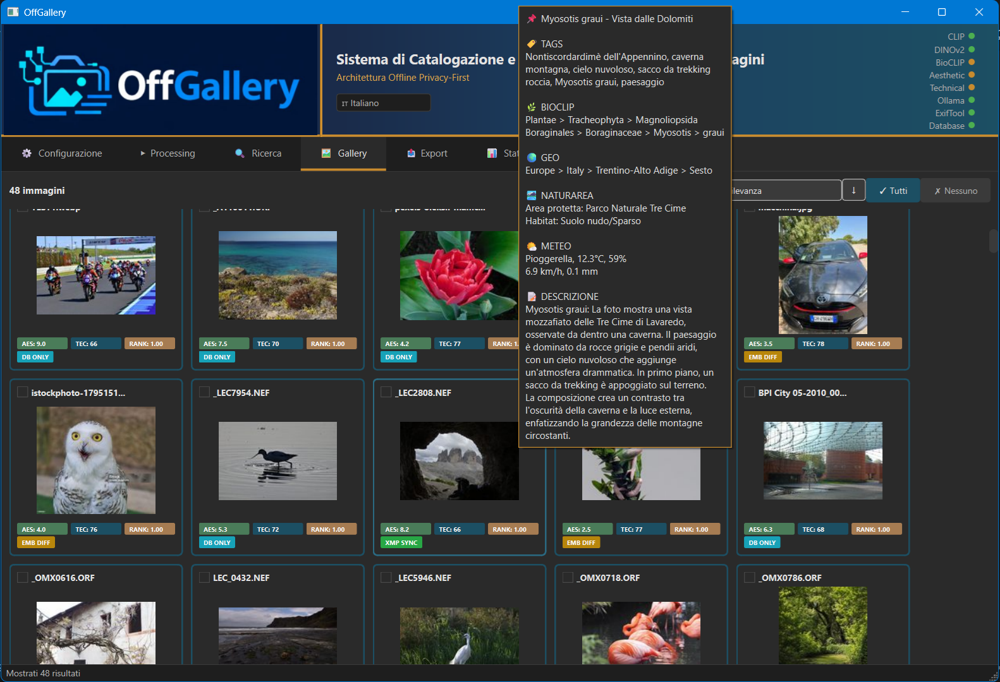

# OffGallery Installation Guide

> **What you get at the end of this guide:**
>
> 
>
> Offline AI cataloguing of naturalistic photos: semantic search, taxonomic classification, EXIF metadata, geolocation and aesthetic/technical score — all without an internet connection after the first launch.

---

## System Requirements

| Component | Minimum | Recommended |
|-----------|---------|-------------|
| **Operating System** | Windows 10 64-bit / Linux 64-bit / macOS 12+ | Windows 11 / Ubuntu 22.04+ / macOS 13+ |
| **RAM** | 8 GB | 16 GB |
| **Disk Space** | 15 GB | 25 GB |
| **GPU (optional)** | — | NVIDIA with 4+ GB VRAM (Windows/Linux) · Apple Silicon M1+ (macOS) |
| **Internet Connection** | Required only on first launch | — |

> **GPU note Windows/Linux**: OffGallery works without an NVIDIA GPU, but processing will be slower. You can choose CPU/GPU in the settings.
>
> **GPU note macOS**: On Apple Silicon (M1/M2/M3/M4) PyTorch automatically uses Metal/MPS for GPU acceleration. On Intel Mac it runs in CPU mode.
>
> **Linux note**: Tested on Ubuntu, Fedora and Arch Linux. Other distributions with conda support should work.
>
> **macOS note**: Supported on Apple Silicon (arm64) and Intel (x86_64). Requires macOS 12 Monterey or later.

---

## Step 0: Download and Extract OffGallery

> **This step is only required if you downloaded the ZIP from GitHub.**
> If you used `git clone`, skip directly to "Quick Installation".

The GitHub ZIP contains an `OffGallery-main` folder inside — that **is** the application root.

**Common mistake:** doing "Extract all" into a folder already named `OffGallery` creates a double folder:
```
OffGallery\
  OffGallery-main\   ← the real root (contains installer\, gui\, etc.)
```
In this case the installer cannot find the files it expects.

**How to extract correctly:**

1. Choose the **parent folder** where you want OffGallery to live — for example `C:\Programs\` or `C:\Users\YourName\`
2. Open the ZIP and click **"Extract all"**, setting that parent folder as the destination
3. `C:\Programs\OffGallery-main\` is created automatically
4. (Optional) Rename the folder as you prefer, e.g. `OffGallery`

The folder that contains `installer\`, `gui\`, `gui_launcher.py` is the correct root. Enter it before proceeding.

---

## Installation — Method 1: Wizard (Recommended)

The wizard handles everything automatically: Miniconda, Python environment, libraries, ExifTool and (optional) Ollama.

> **If the wizard fails or you prefer manual control**, go directly to [Installation — Method 2: Manual (Plan B)](#installation--method-2-manual-plan-b).

### Windows

**[Download OffGallerySetup.exe](https://github.com/HEGOM61ita/OffGallery/releases/latest)**, double-click and follow the wizard.
No terminal, no manual configuration needed. Automatically installs Miniconda, Python environment, libraries and AI models (~8 GB).

> **SmartScreen note**: on first launch Windows may show a security warning. Click **"More info" → "Run anyway"**. The warning is due to the absence of an EV code signing certificate, not a security issue.

> **Alternative method — terminal scripts**: If you downloaded the ZIP from GitHub and prefer the traditional method, open the `installer\` folder and double-click **`INSTALLA_OffGallery.bat`**, then follow the on-screen instructions (answer Y/N).

### Linux

**[Download OffGallerySetup](https://github.com/HEGOM61ita/OffGallery/releases/latest/download/OffGallerySetup)**, make it executable and run it:
```bash
chmod +x OffGallerySetup && ./OffGallerySetup
```
The wizard installs everything graphically — no terminal needed after launch.

> **Alternative method — terminal script**: open a terminal in the OffGallery folder and run `bash installer/install_offgallery_linux_en.sh`, then follow the on-screen instructions (answer y/n to questions).

### macOS

1. Open a **Terminal** in the OffGallery folder
2. Run:
   ```bash
   bash installer/install_offgallery_mac_en.sh
   ```
3. Follow the on-screen instructions (answer y/n to questions)

> **Apple Silicon**: the wizard automatically detects the architecture (arm64 or x86_64) and downloads the correct version of Miniconda.
>
> **Gatekeeper (macOS)**: on the first launch of `OffGallery.app` or `OffGallery.command`, macOS may show a security warning. Use **right-click → Open** to confirm. The installer already removes the quarantine attribute, so the warning normally does not appear.
>
> **Re-runnable**: if the wizard is interrupted, you can re-run it. Steps already completed are detected and skipped automatically.

### What the wizard installs

| | Windows | Linux | macOS |
|---|---------|-------|-------|
| Miniconda | Downloads and installs (default `C:\miniconda3`) | Downloads and installs (`~/miniconda3`) | Downloads and installs (`~/miniconda3`), detects arm64/x86_64 |
| Python environment | Creates `OffGallery` with Python 3.12 | Creates `OffGallery` with Python 3.12 | Creates `OffGallery` with Python 3.12 |
| Python libraries | Installs everything from requirements | Installs everything from requirements | Installs everything from requirements |
| ExifTool | Bundled in `exiftool_files/` | Via apt/dnf/pacman/zypper or local tar.gz | Via Homebrew or local tar.gz |
| Ollama | Optional | Optional | Optional (via Homebrew or official script) |
| Shortcut | `OffGallery.lnk` on the Desktop | Entry in the applications menu | `OffGallery.app` in `~/Applications` + `OffGallery.command` on the Desktop |

**Estimated time**: varies depending on connection speed — most of the time is download. On first launch, OffGallery will automatically download ~6.7 GB of AI models. Subsequent launches will be completely offline.

---

## Installation — Method 2: Manual (Plan B)

> **Use this method only if the wizard had problems**, or if you prefer to control each step individually. The end result is identical.

### Windows — Separate scripts

Run the following scripts in order from the `installer\` folder:

| Step | Script | What it does | Estimated time |
|------|--------|-------------|----------------|
| 1 | `01_install_miniconda.bat` | Checks/installs Miniconda | 5 min |
| 2 | `02_create_env.bat` | Creates Python environment | 2 min |
| 3 | `03_install_packages.bat` | Installs Python libraries | 15–20 min |
| 4 | `06_setup_ollama.bat` | Installs local LLM (optional) | 5–10 min |
| — | **First app launch** | Automatic AI model download | 10–20 min |

For details on each step, see the sections below.

### Linux — Manual commands

```bash
# 1. Install Miniconda (if not present)
curl -fSL https://repo.anaconda.com/miniconda/Miniconda3-latest-Linux-x86_64.sh -o /tmp/miniconda.sh
bash /tmp/miniconda.sh -b -p $HOME/miniconda3
$HOME/miniconda3/bin/conda init bash
# Reopen the terminal after this command

# 2. Create Python environment
conda create -n OffGallery python=3.12 --override-channels -c conda-forge -y

# 3. Install Python libraries
conda run -n OffGallery pip install -r installer/requirements_offgallery.txt

# 4. Install ExifTool
# Ubuntu/Debian:
sudo apt install libimage-exiftool-perl
# Fedora/RHEL:
sudo dnf install perl-Image-ExifTool
# Arch Linux:
sudo pacman -S perl-image-exiftool

# 5. Ollama (optional)
curl -fsSL https://ollama.com/install.sh | sh
ollama pull qwen3-vl:8b-instruct-q4_K_M
```

### macOS — Manual commands

```bash
# 1. Install Miniconda (if not present)
# Apple Silicon:
curl -fSL https://repo.anaconda.com/miniconda/Miniconda3-latest-MacOSX-arm64.sh -o /tmp/miniconda.sh
# Intel (uncomment the line below and comment the one above):
# curl -fSL https://repo.anaconda.com/miniconda/Miniconda3-latest-MacOSX-x86_64.sh -o /tmp/miniconda.sh

bash /tmp/miniconda.sh -b -p $HOME/miniconda3
$HOME/miniconda3/bin/conda init zsh    # zsh is the default shell on macOS
$HOME/miniconda3/bin/conda init bash
# Reopen the terminal after this command

# 2. Create Python environment
conda create -n OffGallery python=3.12 --override-channels -c conda-forge -y

# 3. Install Python libraries
conda run -n OffGallery pip install -r installer/requirements_offgallery.txt

# 4. Install ExifTool
brew install exiftool
# If you don't have Homebrew: https://brew.sh — or download the .pkg from https://exiftool.org

# 5. Ollama (optional)
brew install ollama
# or: curl -fsSL https://ollama.com/install.sh | sh
ollama pull qwen3-vl:8b-instruct-q4_K_M

# 6. Launch
conda run -n OffGallery python gui_launcher.py
```

### Step 1: Install Miniconda

#### What is Miniconda?

Miniconda is a program that lets you install Python and the libraries needed for OffGallery in an isolated way, without interfering with other programs on your computer. It is free and safe.

#### Check if it is already installed

1. **Double-click** `01_install_miniconda.bat`
2. A black window (terminal) will open
3. Read the message:
   - If you see `[OK] Conda already installed` → **Go to Step 2**
   - If you see `[!!] Conda not found` → **Continue reading below**

#### If Miniconda is NOT installed

##### A) Download Miniconda

1. When the script asks `Do you want to open the download page now? (Y/N):`
2. Type `Y` and press **ENTER**
3. The browser will open on the download page
4. Find the **Windows** section and click **Miniconda3 Windows 64-bit**
5. Wait for the download to complete (about 80 MB)

##### B) Install Miniconda

1. Go to the **Downloads** folder and **double-click** the downloaded file
   (the name will be similar to `Miniconda3-latest-Windows-x86_64.exe`)

2. The installer starts. Follow these steps:

   | Screen | What to do |
   |--------|-----------|
   | Welcome | Click **Next** |
   | License Agreement | Click **I Agree** |
   | Select Installation Type | Select **Just Me (recommended)** → Click **Next** |
   | Choose Install Location | Leave the default path → Click **Next** |
   | **Advanced Options** | **IMPORTANT — Check BOTH boxes:** |
   | | **Add Miniconda3 to my PATH environment variable** |
   | | **Register Miniconda3 as my default Python 3.x** |
   | | Then click **Install** |
   | Installing | Wait for completion (1–2 minutes) |
   | Completed | Click **Next** then **Finish** |

   > **Warning**: If you do not check "Add to PATH", the subsequent scripts will not work!

##### C) Verify the installation

1. **Close** all open terminal windows
2. **Double-click** `01_install_miniconda.bat` again
3. You should now see:
   ```
   [OK] Conda already installed on the system
   conda 24.x.x
   ```
4. If you see this message, **Step 1 complete!**

##### Common problems

| Problem | Solution |
|---------|----------|
| Still "Conda not found" after installation | Restart the computer and try again |
| "Add to PATH" was greyed out/disabled | Uninstall Miniconda, reinstall selecting "Just Me" |
| Error during installation | Temporarily disable antivirus |

---

### Step 2: Create the OffGallery Environment

1. **Double-click** `02_create_env.bat`
2. Wait for the message `[OK] Environment "OffGallery" created successfully!`

---

### Step 3: Install Python Packages

This step downloads about **3 GB** of libraries.

1. **Double-click** `03_install_packages.bat`
2. Wait for completion (depends on your connection)
3. You will see `[OK] All packages installed successfully!`

---

### Step 4: Install Ollama (Optional)

> **Ollama is completely optional.** OffGallery works fully without it for semantic search (CLIP), BioCLIP taxonomy, aesthetic/technical scores, EXIF metadata and geolocation. Install Ollama only if you want to generate **automatic descriptions, tags and titles** with an LLM.

**If the one-click installation fails on this step**, do not worry: finish the main installation, then install Ollama separately with `06_setup_ollama.bat` whenever you want — you will have more control over the process.

**PC with little RAM or very slow?** Consider not installing Ollama: OffGallery without LLM remains a complete tool for semantic indexing and visual similarity search.

1. **Double-click** `06_setup_ollama.bat`
2. If Ollama is not installed:
   - Press `Y` to open the download page
   - Download and install **Ollama for Windows**
   - Re-run the script
3. Press `Y` to download the model `qwen3-vl:8b-instruct-q4_K_M` (~5.2 GB, requires 8 GB VRAM)

**Note:** Ollama installs autonomously (`%LOCALAPPDATA%\Programs\Ollama`) and models are saved in `%USERPROFILE%\.ollama\models`. It does not depend on the OffGallery directory — you can install or remove it at any time without touching the rest of the installation.

---

## Critical Library Versions (Pinned)

OffGallery requires specific versions of some libraries to guarantee compatibility with the SigLIP so400m model. If you encounter problems with semantic search (scores always close to zero) or shape mismatch errors, run:

```bash
conda run -n OffGallery pip install transformers==4.57.3 huggingface-hub==0.36.0 open-clip-torch==3.2.0
```

Then re-import the affected photos (reprocess the same folder with "Reprocess all").

> The wizard already installs the correct pinned versions. This step is only needed if you have manually updated these packages.

---

## Launching OffGallery

### Windows

**Method 1 — Desktop shortcut (Recommended):**

The wizard automatically creates the **OffGallery** shortcut on the Desktop:
- **OffGallerySetup.exe** (preferred method): creates **OffGallery.lnk** (main launcher) and **OffGallery Manager.lnk** (for updates and maintenance)
- **INSTALLA_OffGallery.bat** (script method): creates **OffGallery.lnk**

**Double-click** the **OffGallery** shortcut to launch the app.

> **Warning**: do not copy or move `OffGallery_Launcher.bat` to the Desktop or other folders — the `.bat` file uses its own path to find the application and will not work if moved. Always use the `.lnk` shortcut. If you have lost it: right-click `installer\OffGallery_Launcher.bat` → **Send to → Desktop (create shortcut)**.

**Method 2 — From Terminal:**

1. Open the **Anaconda Prompt**
2. Type:
   ```
   conda activate OffGallery
   cd C:\path\to\OffGallery
   python gui_launcher.py
   ```

### Linux

**Method 1 — Applications menu (Recommended):**

If you used the wizard, OffGallery appears in the applications menu. Search for it by name.

**Method 2 — From terminal:**

```bash
bash installer/offgallery_launcher_linux.sh
```

**Method 3 — Manual:**

```bash
conda activate OffGallery
cd ~/path/to/OffGallery
python gui_launcher.py
```

### macOS

**Method 1 — Spotlight / Launchpad (Recommended):**

If you used the wizard, `OffGallery.app` is installed in `~/Applications` and is immediately searchable:
- **Spotlight**: `Cmd+Space` → type *OffGallery* → Enter
- **Launchpad**: search *OffGallery* among the apps
- **Dock**: drag `OffGallery.app` from the `~/Applications` folder

**Method 2 — Double-click on the Desktop:**

The wizard also creates `OffGallery.command` on the Desktop as a quick shortcut.

> On first launch macOS may ask for confirmation. Use **right-click → Open**.

**Method 3 — From terminal:**

```bash
bash installer/offgallery_launcher_mac.sh
```

**Method 4 — Manual:**

```bash
conda activate OffGallery
cd ~/path/to/OffGallery
python gui_launcher.py
```

---

## First Launch

On the **first launch**, OffGallery automatically downloads the required AI models:

| Model | Use | Size |
|-------|-----|------|
| **SigLIP** | Multilingual semantic search | ~1.8 GB |
| **DINOv2** | Visual similarity | ~330 MB |
| **Aesthetic** | Aesthetic scoring | ~1.6 GB |
| **BioCLIP v2 + TreeOfLife** | Flora/fauna classification | ~4.2 GB |
| **Argos Translate** | IT→EN translation | ~92 MB |

**Estimated time**: varies depending on connection (~6.7 GB to download)

Models are downloaded from the frozen repository `HEGOM/OffGallery-models` and saved in the **`OffGallery/Models/`** folder (not in the system cache). Subsequent launches will be **completely offline**.

> If the download is interrupted, restart the app: models already downloaded are not re-downloaded.

---

## Plugins (beta access)

OffGallery includes a plugin system to extend analysis and enrichment capabilities. All plugins are distributed separately from the source code during the beta testing period.

### LLM Plugins — tag, description and title generation

They enable automatic generation of textual content via local LLM Vision models. Two backends are available:

| Plugin | Backend | Default endpoint |
|--------|---------|------------------|
| **Ollama** | Local Ollama | `http://localhost:11434` |
| **LM Studio** | LM Studio server | `http://localhost:1234` |

**LLM generation is optional.** Without LLM plugins, OffGallery works normally for CLIP, DINOv2, BioCLIP, aesthetic/technical scores, search and geolocation.

### Data Plugins — contextual enrichment

They add information derived from GPS, date/time and BioCLIP taxonomy to photos already in the database:

| Plugin | Function |
|--------|----------|
| **GeoNames** | Full geographic hierarchy from GPS (continent → city) |
| **GeoSpecies** | BioCLIP restricted to species expected at the GPS location |
| **NaturArea** | Protected area (WDPA) and habitat (ESA WorldCover) |
| **Weather** | Historical weather conditions at the time of the shot |
| **BioNomen** | Common biological names in 6 languages (GBIF) |

### How to receive the plugins

> **Beta access**: During the beta testing period all plugins are distributed free of charge. To receive them, write to **offgallery.ai.info@gmail.com** stating:
> - Operating system (Windows / Linux / macOS) and version
> - System RAM
> - GPU (model and VRAM) — or "CPU only" if you do not have a dedicated GPU
> - Desired plugins (LLM: Ollama or LM Studio; data plugins: list which ones)
>
> The address will be used exclusively for sending plugins and any update notifications, with no other purposes or sharing with third parties.

### Plugin installation (received zip)

1. Extract the contents of the zip into the `plugins/` folder of your OffGallery installation
2. The resulting structure must be:
   ```
   plugins/
   └── plugin_name/
       ├── __init__.py
       ├── plugin.py       (or main file indicated in the manifest)
       └── manifest.json
   ```
3. Restart OffGallery — the plugin is detected automatically

---

## Troubleshooting

### "conda is not recognized as a command"
- **Windows**: Restart the terminal after installing Miniconda. Verify that "Add to PATH" was selected during installation
- **Linux**: Run `~/miniconda3/bin/conda init bash` and reopen the terminal
- **macOS**: Run `~/miniconda3/bin/conda init zsh` (or `init bash`) and reopen the terminal

### "CUDA not available" / Slow processing
- Normal if you do not have an NVIDIA GPU
- Go to **Settings > Device** and select "CPU"

### Model download fails on first launch
- Check your internet connection
- Restart the app (models already downloaded are not re-downloaded)
- Alternatively, use `python gui_launcher.py --download-models` to force the download

### Problems with Ollama installation during the wizard
If the one-click installer fails on the Ollama step (network errors, timeouts, etc.):
1. **Ignore the error and complete the installation** — OffGallery works without Ollama
2. When you want to add LLM support, run `06_setup_ollama.bat` manually: you will have more control and can choose the best moment

### Ollama not responding
- **Windows**: Make sure Ollama is running (icon in the system tray). Restart Ollama
- **Linux**: Check with `systemctl status ollama` or start with `ollama serve`
- **macOS**: Launch Ollama from the app or run `ollama serve` from the terminal
- **No Ollama?** No problem — semantic search and all other AI models work normally. Tag/description/title generation will simply be disabled.

### Linux: ExifTool not found
- Install via the system package manager:
  - Ubuntu/Debian: `sudo apt install libimage-exiftool-perl`
  - Fedora: `sudo dnf install perl-Image-ExifTool`
  - Arch: `sudo pacman -S perl-image-exiftool`

### Linux: app does not start from the applications menu
- Try from terminal: `bash installer/offgallery_launcher_linux.sh`
- Check that conda is initialised: `conda --version`

### macOS: ExifTool not found
- Install via Homebrew: `brew install exiftool`
- Or download the `.pkg` from [exiftool.org](https://exiftool.org)

### macOS: "cannot be opened" warning (Gatekeeper)
- Use **right-click → Open** on `OffGallery.app` or `OffGallery.command`
- Or from terminal:
  ```bash
  xattr -cr ~/Applications/OffGallery.app
  xattr -c ~/Desktop/OffGallery.command
  ```

### macOS: PyQt6 does not start / black window
- Check that Xcode Command Line Tools are installed: `xcode-select --install`
- If on macOS 11+, make sure `QT_MAC_WANTS_LAYER=1` is set (the launcher does this automatically)

### Semantic search scores always close to zero
- Embeddings were probably generated with an incompatible version of the library
- Run: `conda run -n OffGallery pip install transformers==4.57.3 huggingface-hub==0.36.0 open-clip-torch==3.2.0`
- Then reprocess the affected photos with "Reprocess all" in the Processing tab

### Incorrect geotag (wrong city for GPS coordinates)
- This was a bug in versions prior to 10 Mar 2026 affecting photos taken West or South of the Greenwich meridian
- Reprocess the affected photos after updating to the latest version

---

## Disk Space Used

> **GPU note**: the Python environment size varies greatly depending on the GPU.
> PyTorch CPU weighs ~700 MB; PyTorch CUDA 11.8 weighs ~2.2 GB + ~1 GB of CUDA runtime libraries.
> The estimates below show both cases.

### Windows

| Component | Location | CPU only | NVIDIA GPU (CUDA) |
|-----------|----------|----------|-------------------|
| Miniconda base | `C:\miniconda3` | ~400 MB | ~400 MB |
| OffGallery environment | `C:\miniconda3\envs\OffGallery` | ~3.5 GB | ~7 GB |
| **AI Models** | **`OffGallery\Models\`** | **~6.7 GB** | **~6.7 GB** |
| Argos Translate | `%USERPROFILE%\.local\share\argos-translate` | ~92 MB | ~92 MB |
| Ollama + model | `%LOCALAPPDATA%\Ollama` | ~3.5 GB | ~3.5 GB |
| **Total** | | **~14 GB** | **~18 GB** |

### Linux

| Component | Location | CPU only | NVIDIA GPU (CUDA) |
|-----------|----------|----------|-------------------|
| Miniconda base | `~/miniconda3` | ~400 MB | ~400 MB |
| OffGallery environment | `~/miniconda3/envs/OffGallery` | ~3.5 GB | ~7 GB |
| **AI Models** | **`OffGallery/Models/`** | **~6.7 GB** | **~6.7 GB** |
| Argos Translate | `~/.local/share/argos-translate` | ~92 MB | ~92 MB |
| Ollama + model | `~/.ollama` | ~3.5 GB | ~3.5 GB |
| **Total** | | **~14 GB** | **~18 GB** |

### macOS

> CUDA is not available on macOS. Apple Silicon uses Metal/MPS (included in standard PyTorch, no additional overhead).

| Component | Location | Size |
|-----------|----------|------|
| Miniconda base | `~/miniconda3` | ~400 MB |
| OffGallery environment | `~/miniconda3/envs/OffGallery` | ~3.5 GB |
| **AI Models** | **`OffGallery/Models/`** | **~6.7 GB** |
| Argos Translate | `~/Library/Application Support/argos-translate` | ~92 MB |
| Ollama + model | `~/.ollama` | ~3.5 GB |
| **Total** | | **~14 GB** |

---

## Moving the AI Models to Another Drive

If the main drive does not have enough space, you can move the `Models/` folder to another drive after installation.

1. **Move the folder** `OffGallery/Models/` to the desired destination (e.g. `E:\MyModels\OffGallery`)
2. **Launch OffGallery** and go to the **Configuration** tab
3. In the **Paths & Database** section, **AI Models** field, enter the absolute path of the new location (e.g. `E:\MyModels\OffGallery`)
4. Click **Save**
5. Restart the app

> **Warning**: change the path only after physically moving the folder. If the path does not exist, OffGallery will consider the models missing and attempt to re-download them.

---

## Support

For problems or questions, consult the [documentation](../README.md) or open an issue on GitHub.
